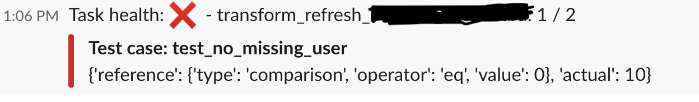

# healthcheck_operator

This operator handles the healthcheck of tables in data warehouse.

Upon finishing the test suites, it will send the result to slack.

Features:

1. generic wrapper around any Airflow Operator, easy integration with existing
    system
    
2. test SQLs are arranged in the same way as the data warehouse schema, more intuitive
    for data engineers to implement and debug
    
3. allow `warning only` / `blocking upon failure` for different level of strictness

 
# Requirements and Setup

1. Drag the `healthcheck_operator.py` file into your Airflow Plugins Home, it could
    be found in `airflow.cfg` under `plugins_folder` field.

2. Install necessary dependencies / add them to your requirements file

3. Configure the settings in the top part of the plugin file

4. (Optional) Register new Operators in the same plugin file, at the bottom of the plugin.
Refer to the `py` file for detailed steps.

5. Replace your existing Operators with the newly registered Healthcheck Operators,
added in necessary arguments

6. test with `airflow test`

# Argument

We only list down additional Task Instance arguments here.

| Argument Name      | Type           | Description |
| ------------- |:-------------:| -----:|
| dw_conn_id | str | data warehouse airflow connection ID |
| test_sql | str | relative path to test SQL for this operator |
| test_reference | dict | specify test name, type and expected value to check against |
| verbose | boolean | sent more verbose message to slack |
| block_on_failure | boolean | whether failing the transformation task would block the subsequent tasks |
| users_to_alert | tuple | slack users to include when healthcheck fails|

# Example

### Operator:

```
task = HealthCheckBashOperator(
    task_id='foo',
    bash_command="echo 'hello'",
    dw_conn_id='test-conn',
    test_sql='schema_name/table_name.sql',
    test_reference={
        'hello': {
            'type': 'existence'
        },
        'hello2': {
            'type': 'comparison',
            'operator': 'eq',
            'value': 1
        }
    },
    verbose=True,
    block_on_failure=True,
    dag=dag
)
```

### Test SQL file:

```
-- name: hello
SELECT
    *
FROM public.table_name;

-- name: hello2
SELECT
    COUNT(*)
FROM public.users WHERE user_id < 10;
```

### Slack alerts (not in verbose mode):

Passed cases:


Failed cases:


